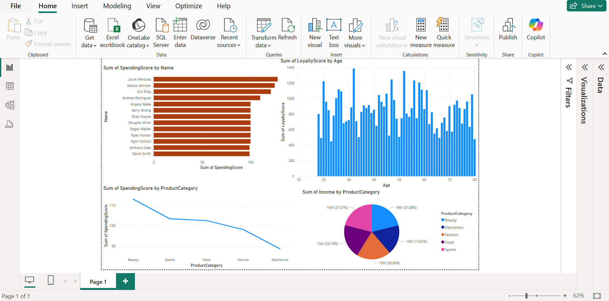

# customer-personality-analysis
 # Power BI Project: 1st powerbi project

## Overview
This is my first Power BI project where I have created a [type of report/dashboard] to analyze and visualize [brief description of the data]. The goal of this project is to showcase my skills in data visualization and analysis using Power BI. 

## Project Description
In this project, I used Power BI to create interactive reports and dashboards that provide insights into [specific business area or dataset]. The project includes the following key components:
- **Data Source**: The data for this project comes from [mention data source(s), such as Excel files, SQL databases, APIs, etc.].
- **Data Processing**: I used Power Query Editor for data cleaning, transformation, and preparation before visualizing the data in Power BI.
- **Visualizations**: Various charts, graphs, and tables were created to represent the data, including [mention specific types of visualizations, e.g., bar charts, line graphs, pie charts, etc.].
- **Key Insights**: The project aims to provide insights into [mention the key findings or objectives of your analysis, such as trends, patterns, or performance metrics].

## Features
- Interactive and dynamic dashboards
- Real-time data filtering and slicing
- Custom calculated columns and measures using DAX
- Data exploration with different types of visualizations (e.g., pie charts, bar charts, line graphs, etc.)
- [Any other features you implemented]

## Screenshots

## Setup and Requirements
To explore and view the Power BI report:
1. Download and install [Power BI Desktop](https://powerbi.microsoft.com/desktop/) if you don't already have it.
2. Open the `.pbix` file using Power BI Desktop.
3. Review the interactive visualizations and explore the report.

## File Structure
- `ProjectName.pbix`: The Power BI report file containing the visualizations and analysis.
- `DataSources/`: Folder containing the raw data files (if applicable).
- `Screenshots/`: Folder with images/screenshots of key visualizations (optional).

## Installation (If applicable)
If your Power BI report relies on any external data sources or scripts, provide installation instructions here. For example:
1. Install necessary libraries (if Python or R scripts are used in the Power BI report).
2. Set up data sources and make sure they are correctly linked.

## Conclusion
This project demonstrates the power of Power BI in transforming raw data into meaningful insights through interactive visualizations. It showcases my ability to work with various data sources, clean and prepare data, and create visually compelling reports that provide business value.

## Contact
If you have any questions or feedback, feel free to reach out to me at [your email or GitHub link].

